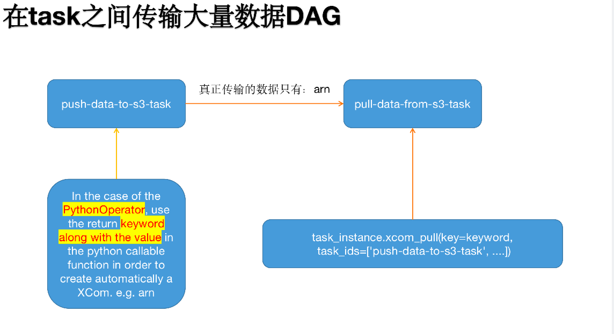

- [1. CONTENT](#1-content)
  - [1.1. Best Practices](#11-best-practices)
    - [1.1.1. Writing a DAG](#111-writing-a-dag)
    - [1.1.2. Creating a task](#112-creating-a-task)
    - [1.1.3. Deleting a task](#113-deleting-a-task)
    - [1.1.4. Communication Cross Tasks](#114-communication-cross-tasks)
    - [1.1.5. Security](#115-security)
    - [1.1.6. Variables](#116-variables)
    - [1.1.7. Top level Python Code](#117-top-level-python-code)
    - [1.1.8. Mocking variables and connections](#118-mocking-variables-and-connections)

## 1. CONTENT

### 1.1. Best Practices

Creating a new DAG is a two-step process:

- writing Python code to create a DAG object,
- testing if the code meets our expectations

This tutorial will introduce you to the best practices for these two steps.

#### 1.1.1. Writing a DAG

Creating a new DAG in Airflow is quite simple. However, there are many things that you need to take care of to ensure the DAG run or failure does not produce unexpected results.

#### 1.1.2. Creating a task

You should treat tasks in Airflow equivalent to `transactions` in a database. This implies that you should never produce incomplete results from your tasks. An example is not to produce incomplete data in `HDFS` or `S3` at the end of a task.

Airflow can retry a task if it fails. Thus, the tasks should produce the same result on every re-run. Some of the ways you can avoid producing a different result -

- Do not use `INSERT` in a task, an `INSERT` statement might lead to `duplicate rows` in your database. Replace it with `UPSERT`.

- Read and write in a specific partition. Never read the latest available data in a task. Someone may update the input data between re-runs, which results in different outputs. A better way is to read the input data from a specific partition. You can use `execution_date` as a partition. You should follow this partitioning method while writing data in S3/HDFS, as well.

- The python datetime `now()` function gives the current datetime object. `This function should never be used inside a task, especially to do the critical computation, as it leads to different result on each run.` It’s fine to use it, for example, to generate a temporary log.

**Tip**

You should define repetitive parameters such as `connection_id` or S3 paths in `default_args` rather than declaring them for each task. The `default_args` help to avoid mistakes such as spelling errors.

#### 1.1.3. Deleting a task

Never delete a task from a DAG. In case of deletion, the historical information of the task disappears from the Airflow UI. It is advised to create a new DAG in case the tasks need to be deleted.

#### 1.1.4. Communication Cross Tasks

Airflow executes tasks of a DAG on different servers in case you are using [Kubernetes executor](https://airflow.apache.org/docs/apache-airflow/stable/executor/kubernetes.html) or [Celery executor](https://airflow.apache.org/docs/apache-airflow/stable/executor/celery.html). Therefore, you should not store any file or config in the local filesystem as the next task is likely to run on a different server without access to it — for example, a task that downloads the data file that the next task processes. In the case of [`Local executor`](https://airflow.apache.org/docs/apache-airflow/stable/_api/airflow/executors/local_executor/index.html#airflow.executors.local_executor.LocalExecutor), storing a file on disk can make retries harder e.g., your task requires a config file that is deleted by another task in DAG.

If possible, use `XCom` to communicate small messages between tasks and a good way of passing larger data between tasks is to use a remote storage such as S3/HDFS. For example, if we have a task that stores processed data in S3 that task can push the S3 path for the output data in `Xcom`, and the downstream tasks can pull the path from XCom and use it to read the data.



#### 1.1.5. Security

The tasks should also not store any authentication parameters such as passwords or token inside them. Where at all possible, use [Connections](https://airflow.apache.org/docs/apache-airflow/stable/concepts/connections.html) to store data securely in Airflow backend and retrieve them using a unique connection id.

#### 1.1.6. Variables

You should avoid usage of Variables outside an operator’s `execute()` method or Jinja templates if possible, as Variables create a connection to metadata DB of Airflow to fetch the value, which can slow down parsing and place extra load on the DB.

Airflow parses all the DAGs in the background at a specific period. The default period is set using `processor_poll_interval` config, which is by default 1 second. During parsing, Airflow creates a new connection to the metadata DB for each DAG. This can result in a lot of open connections.

The best way of using variables is via a Jinja template, which will delay reading the value until the task execution. The template syntax to do this is:

```jinja2
{{ var.value.<variable_name> }}
```

or if you need to deserialize a json object from the variable :

```jinja2
{{ var.json.<variable_name> }}
```

#### 1.1.7. Top level Python Code

In general, you should not write any code outside of defining Airflow constructs like Operators. The code outside the tasks runs every time Airflow parses an eligible python file, which happens at the minimum frequency of [min_file_process_interval](https://airflow.apache.org/docs/apache-airflow/stable/configurations-ref.html#config-scheduler-min-file-process-interval) seconds.

#### 1.1.8. Mocking variables and connections

When you write tests for code that uses variables or a connection, you must ensure that they exist when you run the tests. The obvious solution is to save these objects to the database so they can be read while your code is executing. However, reading and writing objects to the database are burdened with additional time overhead. In order to speed up the test execution, it is worth simulating the existence of these objects without saving them to the database. For this, you can create environment variables with mocking [`os.environ`](https://docs.python.org/3/library/os.html#os.environ) using `unittest.mock.patch.dict()`.

For variable, use [`AIRFLOW_VAR_{KEY}`](https://airflow.apache.org/docs/apache-airflow/stable/cli-and-env-variables-ref.html#envvar-AIRFLOW_VAR_-KEY).

```python
with mock.patch.dict('os.environ', AIRFLOW_VAR_KEY="env-value"):
    assert "env-value" == Variable.get("key")
```

For connection, use [`AIRFLOW_CONN_{CONN_ID}`](https://airflow.apache.org/docs/apache-airflow/stable/cli-and-env-variables-ref.html#envvar-AIRFLOW_CONN_-CONN_ID).

```python
conn = Connection(
    conn_type="gcpssh",
    login="cat",
    host="conn-host",
)
conn_uri = conn.get_uri()
with mock.patch.dict("os.environ", AIRFLOW_CONN_MY_CONN=conn_uri):
  assert "cat" == Connection.get("my_conn").login
```

